# springbootA369
springbootA369鲜花销售商城LW
 
## 查看主页获取源码

### 一、关键词

鲜花销售商城、花卉商城、线上花店

 

### 二、作品包含

源码+数据库+万字文档+全套环境和工具资源+部署教程

 

### 三、项目技术

前端技术：Html、Css、Js、Vue2.0、Element-ui 
数据库：MySQL
后端技术：Java、SpringBoot2.0、MyBatis

  
 

### 四、运行环境

开发工具：IDEA/eclipse  + vscode

数据库：MySQL5.7（最低要5.7版本）

数据库管理工具：Navicat10以上版本

环境配置软件： JDK1.8 + Maven3.6.3

前端Nodejs：14

浏览器：谷歌浏览器

 

### 五、项目介绍

项目编号：springbootA369

随着互联网突飞猛进的发展及其对人们的生活产生至关重要的影响，线上购花的购物方式受到了越来越多顾客的接受与喜爱。线上花卉小铺的设计与实现不仅可以带来更广泛的选择与实惠的价格，提供便利且优质的服务，而且可以更高效地宣传种植培养经验、花束的花语等花卉的相关知识，提高大家的文化素养，丰富精神世界。

后台（管理员）:登录，首页，用户管理，商品管理，订单管理，财务管理，系统管理，充值管理，角色管理，个人中心 

前台（用户）:注册，登录，首页，自商城区，登录，注册，我的订单，我的收藏，个人中心，购物车，评论 

 

### 六、运行截图

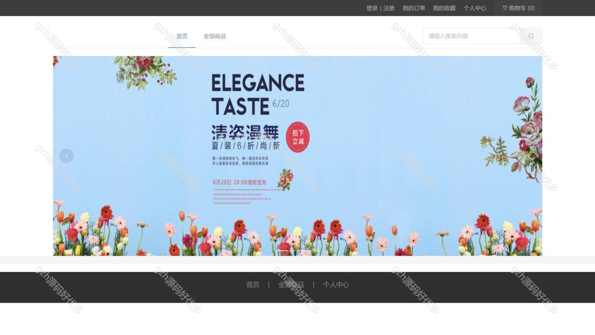
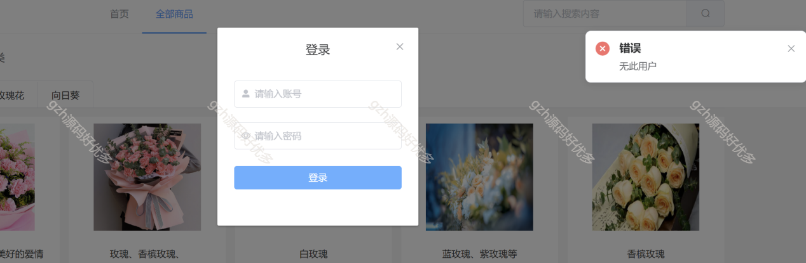
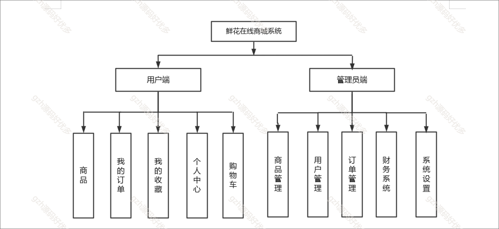
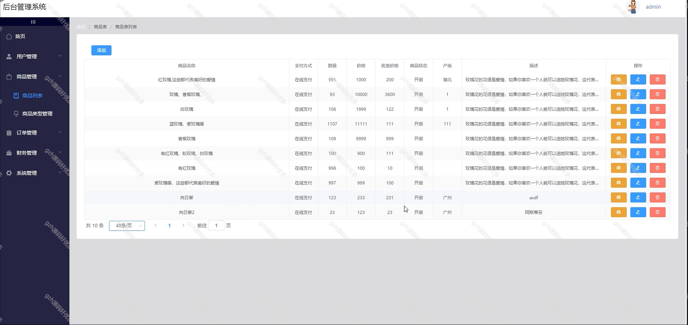
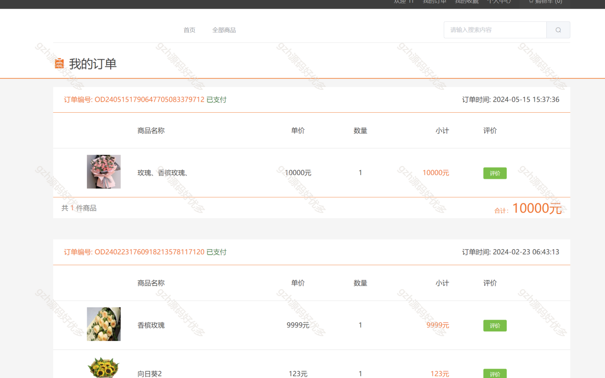
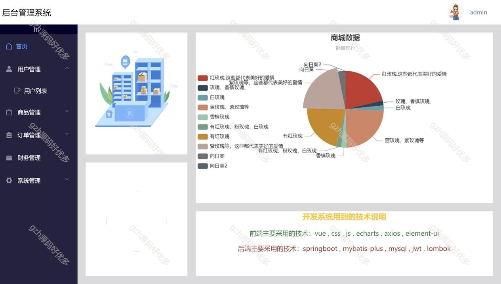
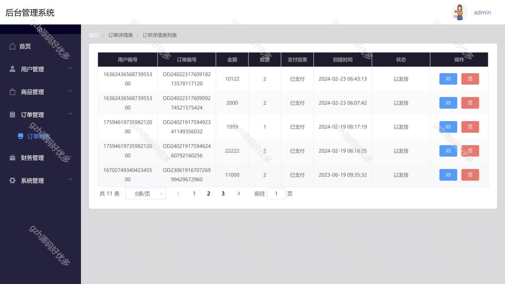
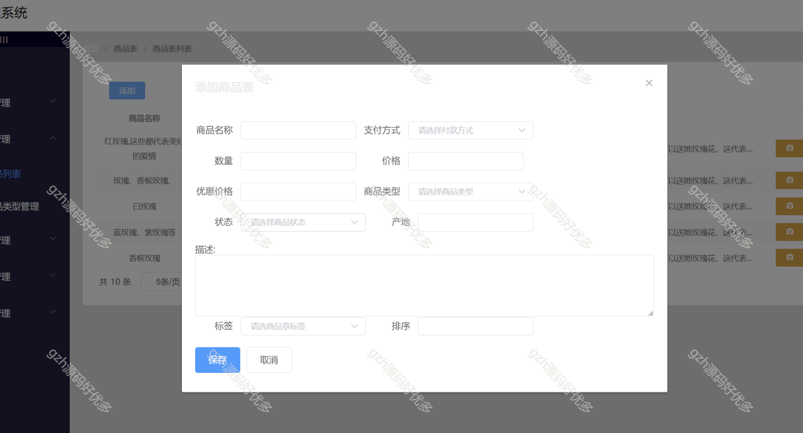
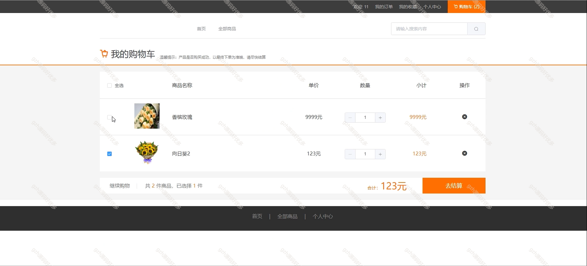
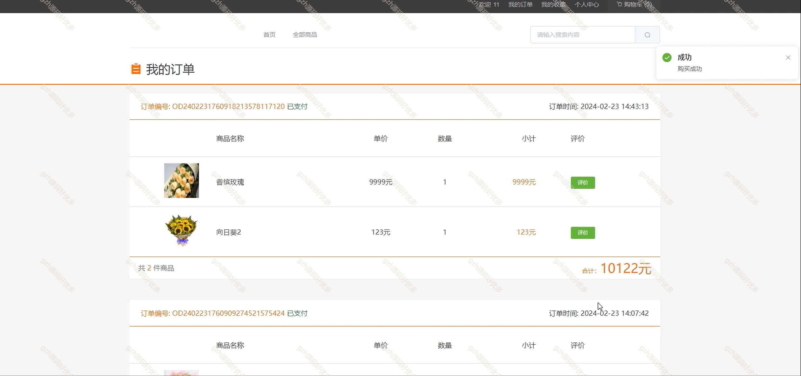
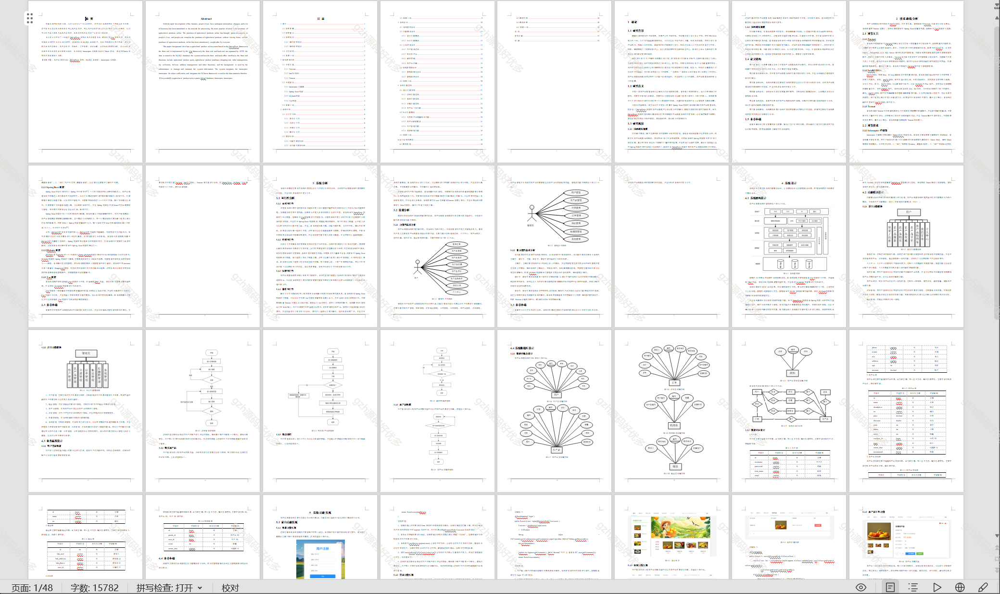
